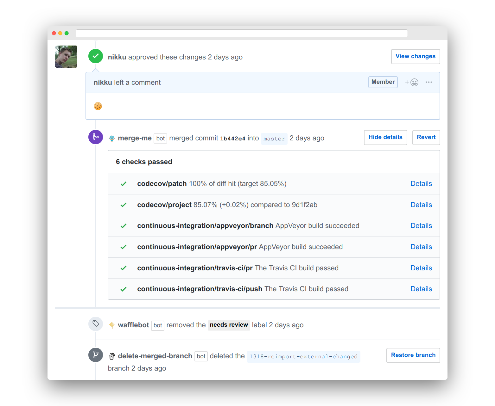

# merge-me

[](https://travis-ci.com/nikku/merge-me)
[](https://codecov.io/gh/nikku/merge-me)

A GitHub App built with [Probot](https://probot.github.io) that merges your pull requests once all required checks pass.




## Installation

Consume as [GitHub app](https://github.com/apps/merge-me) or fork and deploy your own instance.


## Features

* Zero configuration
* Enforces [branch protection rules](https://help.github.com/articles/about-protected-branches/), if configured
* Applies [sensible defaults](#merge-rules) in the absence of branch protection
* Merges using the _rebase_ strategy


## Merge Rules

In the absence of [branch protection rules](https://help.github.com/articles/about-protected-branches/) the app ensures a pull request meets the following conditions before merging:

* _At least one_ status check exists
* All status checks are _completed_
* All status checks got the outcome _successful_ or _neutral_
* _At least one_ review approval by a repository collaborator exists
* No reviewer requested changes

Rules may be overridden / fine tuned with [additional configuration](#configuration).


## Configuration

The bot can be configured by placing a `.github/merge-me.yml` file into your repository. 

#### `minApprovals=1`

The amount of approvals required in order to merge a PR. Defaults to `1`, will always be at least `1` for external contributions.

##### Example

```yml
minApprovals: 2
```

#### `reviewTeams`

Teams to account for when checking for approvals. This option is enabled for organizational repositories only and requires the `members` permission.

If `reviewTeams` is specified the bot will check for approvals per team that is involved in the PR. To do this, it deduces the effective teams to account for from existing and requested reviewers and their team memberships.

If any effective review team is missing the required amount of `minApprovals` merging of the PR is rejected.

##### Example

```yml
reviewTeams:
- design
- development
```


## Related

This app works nicely with others:

* [WIP](https://github.com/apps/wip) - prevents merging of branches that you tag as _work in progress_
* [delete-merged-branch](https://github.com/apps/delete-merged-branch) - deletes the feature branch once merged

Combine the apps as needed for a great merge flow.


## Setup

```sh
# install dependencies
npm install

# run the bot
LOG_LEVEL=debug npm start

# test the bot
LOG_LEVEL=debug npm test
```


## Alternatives

Consider [probot-auto-merge](https://github.com/bobvanderlinden/probot-auto-merge) if you need a bot with more configuration options. It includes many of the features provided by [related apps](#related), too.


## License

[MIT](LICENSE)
